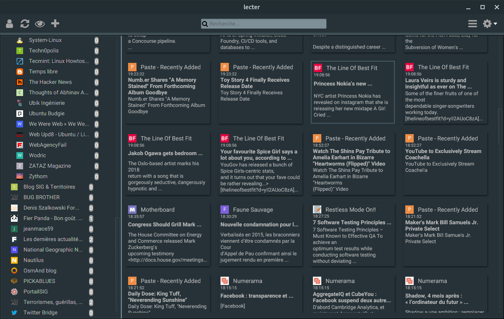
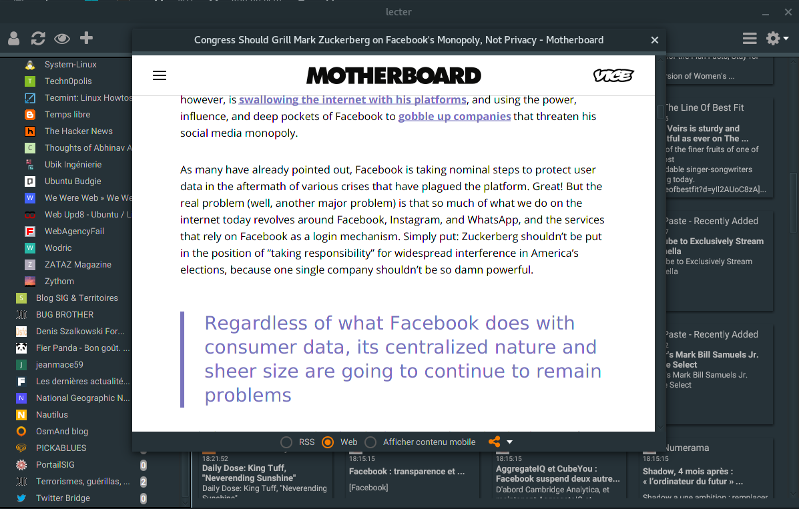
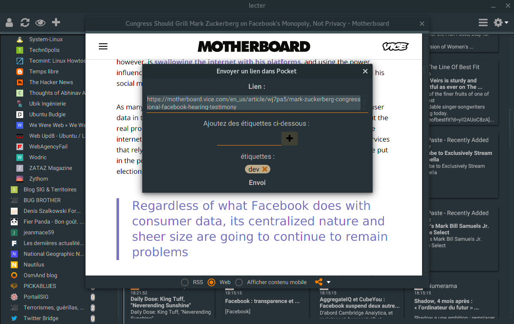
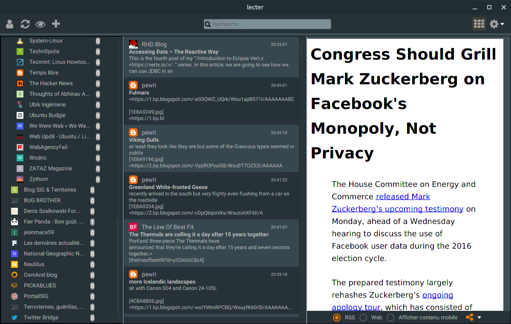
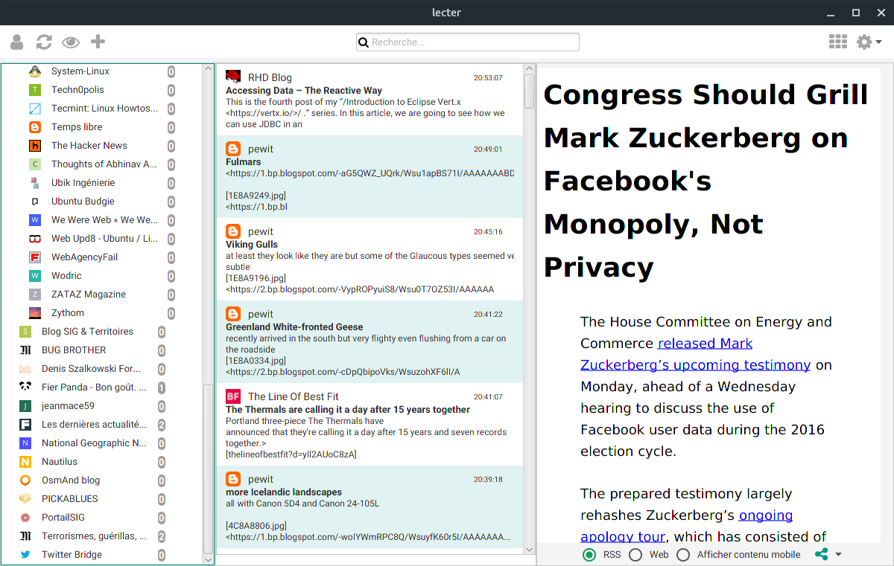
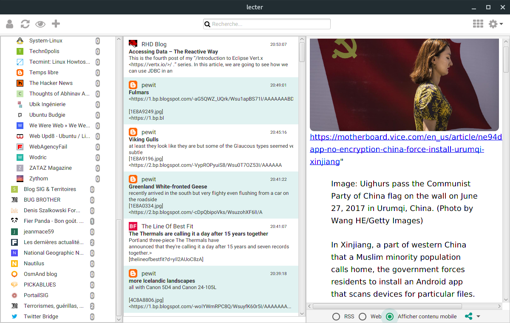
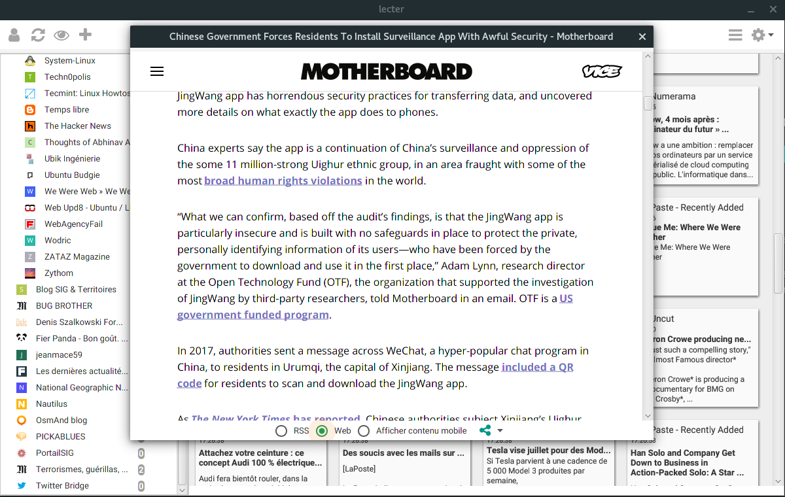
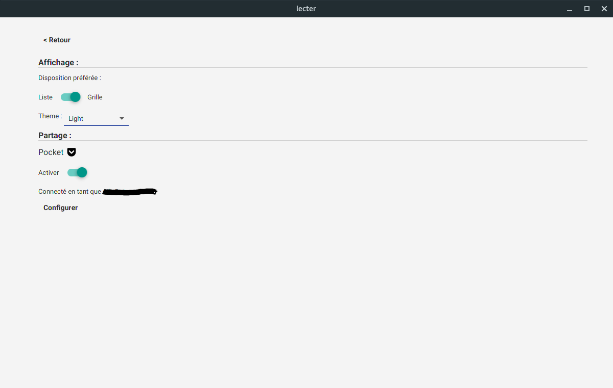
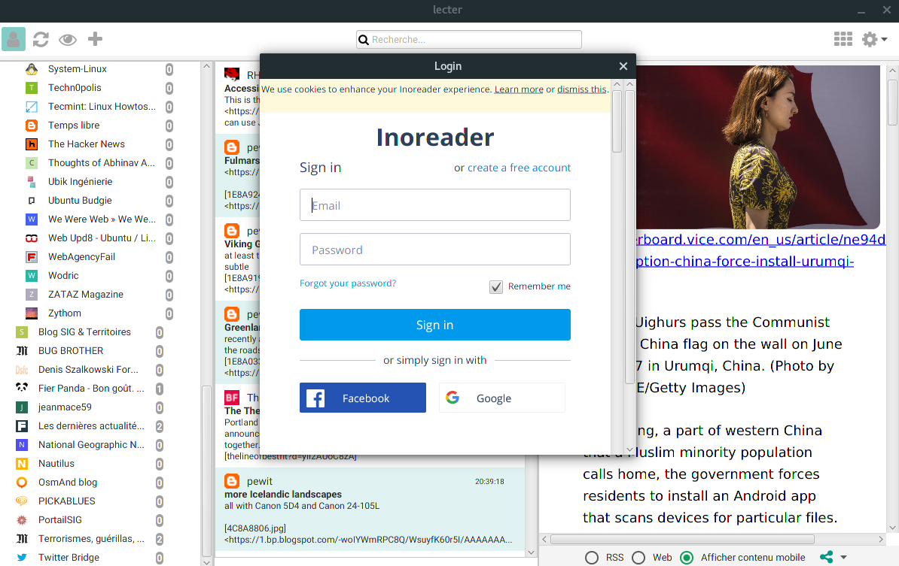

# lecter

An Inoreader Desktop App  
Still in early stage.

The app is destined to become a client for online aggregators like Inoreader, Commafeed etc...

## layout

Two layouts available : 

* three pane view 
 

* grid view

And two themes for the moment a light one and a dark one.

## Content

For each article there are three contents : 

* the rss feed content

* the web article (from the original website)

* the cleaned up/mobile content (provided by The Mercury Web Parser https://mercury.postlight.com/)

The app supports internationalization, currently english and french are provided.

Translations are welcome !

## Services

The articles can be shared to Pocket directly from the lecter.

Support for Wallabag and Instapaper is planned.

## Screenshots

## Currently

Currently being rewritten after being forked from <https://github.com/PerfectDay20/ReadDay>

A renaming occured to reflect this and the app now lives its own life.

## Why the supid name ?

Well all RSS apps are called Feed or Reader or a combo of both.

In french reader is translated lecteur and lecteur has the same pronounciation as lecter.

